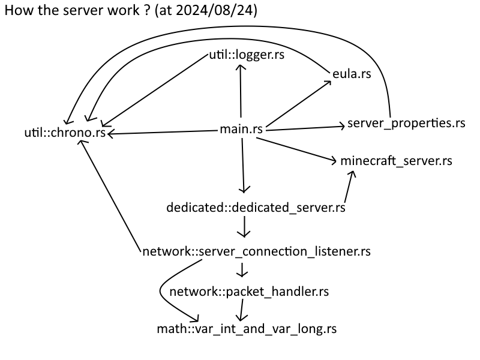

# So you want to understand how the server work ?
### At 2024/08/24
### That's cool, so, here is how it works:

### 

Yeah, it's a mess

## How the server work ?
### 1) **[main.rs](src/main.rs)**

This is where the whole program runs. 
This file execute in a first time the **main** function. 
The **main** function call in a first place. This function call the **setup_logging** function stored in **[logger.rs](src/util/logger.rs)** (it start the logger system that store and show the logs of the software). 
Then it call the function **logs_size** from** **[logger.rs](src/util/logger.rs)**, this function just show the "size" of the logs in octets and bytes.

AND after that we call the function **server_setup** defined later in the **[main.rs](src/main.rs)** file. 
This function is the pure core of the entire software. 
From here we set up the clap crate (used for taking parameters from command line calls).
You can read how its work it is not that hard to understand but not perfect for the eyes. The principal parameter we take care the port one. 
First in this we call the functions **has_agreed_to_eula** from **[eula.rs](src/eula.rs)** and **check_server_properties** from **[server_properties.rs](src/server_properties.rs)** these two functions are used to check if the EULA are agreed and if the server.properties file is created.
AND FINALLY from here we call the **[dedicated_server.rs](src/dedicated/dedicated_server.rs)** with in parameters the custom port or the standard Minecraft port (25565).